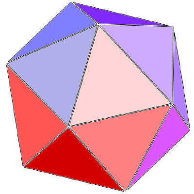
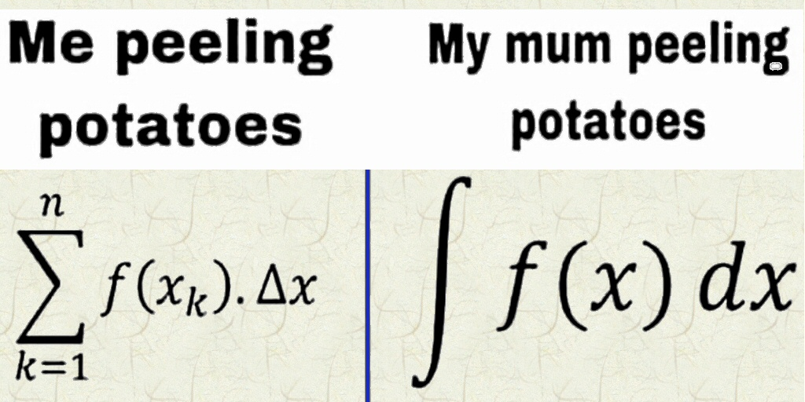
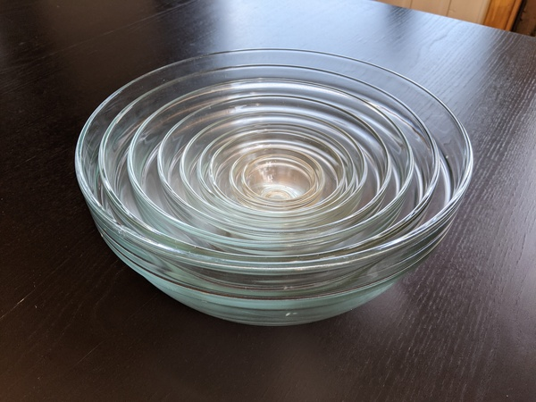

class: center, middle

# Numgrid and other developments

## Radovan Bast [@\_\_radovan](https://twitter.com/__radovan)

## Text is CC-BY

---

.cite[https://www.reddit.com/r/mathmemes/comments/imy8jj/id_make_the_reverse_of_this_joke_but_it_would_be/]

---

# Plan

.left-column60[
### - History
### - How molecular integration grids work
### - Numgrid: https://github.com/dftlibs/numgrid
### - Demonstration
### - Why Rust?
### - Ongoing work/ future plans
]
.right-column40[

]

---

## History: why writing the 58th numerical grid code?

- In [OpenRSP](https://github.com/openrsp/openrsp) (ca. 2013) we needed a numerical grid which had an .emph[open source license]

- My goal now is to create a tool that is .emph[easy to install and use]

---

## Approximation by numerical quadrature

`$$ I = \int f(\mathbf r) d \mathbf r \approx \sum_i^n w_i f(\mathbf r_i) $$`

- `\( \mathbf r_i \)`: grid coordinates/roots/abscissas
- `\( w_i \)`: grid weights

`$$ I_A \approx \sum_{i \in A}^n
                w_i^\text{partitioning} (\{\mathbf R\})
                w_i^\text{radial} w_i^\text{angular}
                f(\mathbf r_i) $$`

### In addition to basis set and functional, we have 3 additional dials

- Radial grid
- Angular grid
- Space partitioning

---

## Radial grid

### There are many schemes

- Lindh-Malmqvist-Gagliardi, https://dx.doi.org/10.1007/s002140100263
- Krack-Köster, https://doi.org/10.1063/1.475719
- MultiExp, https://doi.org/10.1002/jcc.10211
- Treutler-Ahlrichs, https://doi.org/10.1063/1.469408
- Mura-Knowles, https://doi.org/10.1063/1.471749

### Notes

- Some are basis set dependent, some are not
- The grid has an extent (example: Ne, aug-cc-pVTZ)
  - LMG (164 points): ... to ... bohr
  - KK (164 points): ... to ... bohr
- If there is no grid, XC does not "see" anything
- Basis set-dependent grids: be careful when estimating BSSE

---

## Angular grid (1/2)

- Lebedev, [series of papers](https://people.sc.fsu.edu/~jburkardt/c_src/sphere_lebedev_rule/sphere_lebedev_rule.html)

- Tabulated: {6,    14,   26,   38,   50,   74,   86,   110,  146,
  170,  194,  230,  266,  302,  350,  434,  590,  770,
  974,  1202, 1454, 1730, 2030, 2354, 2702, 3074, 3470,
  3890, 4334, 4802, 5294, 5810} points on unit sphere

- They have a well defined accuracy in terms of angular momentum

---

## Angular grid (2/2)

- If you integrate a closed-shell atom in vacuum, without external fields, you don't need many angular points

- Pruning: atom centers are more "spherical" closer to the center

- There are adaptive schemes, see for instance
  Krack-Köster, https://doi.org/10.1063/1.475719

---

## Space partitioning

.left-column40[

.cite[https://en.wikipedia.org/wiki/Voronoi_diagram (CC-BY-SA)]
]
.right-column60[
- Becke, https://dx.doi.org/10.1063/1.454033
- Stratmann-Scuseria-Frisch, https://doi.org/10.1016/0009-2614(96)00600-8
- Laqua-Kussmann-Ochsenfeld, section III.C of https://doi.org/10.1063/1.5049435
]

`$$ I_A \approx \sum_{i \in A}^n
                w_i^\text{partitioning} (\{\mathbf R\})
                w_i^\text{radial} w_i^\text{angular}
                f(\mathbf r_i) $$`

### Two things to remember

- Scaling with system size enters here
- Grid weight derivatives can enter here

---

## Lessons learned

- We are trained to calibrate Hamiltonian, basis set, functional/correlation

- .emph[Always calibrate the grid] for one system before computing the whole table of numbers/functionals/molecules/...

- It can be difficult to say whether a grid is appropriate but it can be easy to check whether it is not

- Report the grid that you are using

---

class: center, middle, inverse

# Demo time

## https://github.com/dftlibs/numgrid

You can test it out as well

---

class: center, middle, inverse

# Why Rust?

---

## Why [Rust](https://www.rust-lang.org/)? (1/2)

- First stable release, released in 2015
- Most-loved programming language in the 2016, 2017, 2018, 2019, and 2020
  [Stack Overflow annual surveys](https://insights.stackoverflow.com/survey/)

- .emph[Fast but also safe]

- Memory safety

- Thread safety

- Type system and type safety

---

## Why [Rust](https://www.rust-lang.org/)? (2/2)

- Zero cost abstractions

- Compiler catches most errors (if it compiles, it often just works)

- Compiler provides helpful error messages

- Private and immutable by default

- Great tooling (testing, documentation, auto-formatter, dependency management, package registry, no makefiles needed)

### More reading

- [Rust by Example](https://doc.rust-lang.org/rust-by-example/)

- More info and resources: https://github.com/dev-cafe/rust-demo

- [J. M. Perkel, "Why scientists are turning to Rust", Nature 588, 185-186 (2020)](https://doi.org/10.1038/d41586-020-03382-2)

---

## Why [Rust](https://www.rust-lang.org/)? (FAQ)

.quote["But is it as fast as Fortran/C/C++?"]
- **Yes!**

.quote["How about math/scientific libraries?"]
- **No problem**. It has very good inter-op with C (and Python) so you can link to any C interface.

.quote["Do we need to rewrite everything now?"]
- **No**. Rust can interface to Fortran via `iso_c_binding`.

.quote["How about shared-memory parallelization?"]
- **Easier**. And thread safe.

.quote["How about MPI?"]
- A **bit too early** for this. I would do the MPI layer with Python/C/C++/Fortran and
  the intra-node with Rust.

---

class: center, middle, inverse

# The future (?)

---

## Ongoing work (1/2)

### Numerical integration (Python+Rust)

- Future:
  - [Support for more quadratures](https://github.com/dftlibs/numgrid/issues/43)
  - Simpler API
  - Geometric weight derivatives (using automatic differentiation)

### Density evaluation (Python+Rust)

- Goal: Python package for .emph[fast and robust] densities and density derivatives
- Status: Working on derivatives, to be released in 2021

### Exchange-correlation integration (Python+Rust)

- Goal: Fast and robust code which can serve as .emph[reference implementation]
- Status: Waiting for the density code to get ready, then relatively trivial

---

## Ongoing work (2/2)

### Exchange-correlation derivatives (Python)

- Arbitrary order exchange-correlation functional derivatives using [JAX](https://jax.readthedocs.io)
- https://github.com/dftlibs/xcauto

### Grimme D3-dispersion energy and their derivatives (Python)

- Collaboration with R. Di Remigio, M. Ringholm, R. Gonzalez
- Status: Writing paper

### Density visualization

- This is what I really want to get to. Super fast and .emph[easy to use] (Python).
